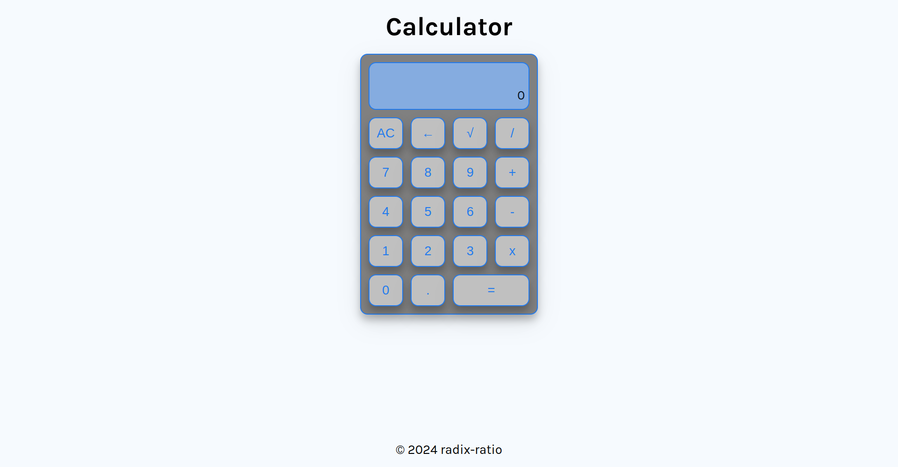

# Calculator
A simple calculator built using HTML, CSS, and JavaScript as part of The Odin Project's Foundations curriculum.

## Description

This project is a basic calculator that allows users to perform arithmetic operations such as addition, subtraction, multiplication, and division. The calculator also includes a clear function to reset the input field.

## Features

- Basic arithmetic operations: addition, subtraction, multiplication, and division
- Clear function to reset the input field
- User-friendly interface with a responsive design

## Demo

[**Live Demo**](https://kacper-korzen.github.io/calculator) | [**Project Specs**](https://www.theodinproject.com/lessons/foundations-calculator) 

## Screenshots

## Technical Details
- Built using HTML, CSS, and JavaScript
- Utilizes a simple event listener to handle button clicks and perform calculations

## Getting Started
1. Open the calculator in a web browser.
2. Enter a number in the input field using the number buttons or the keyboard.
3. Select an operation using the corresponding button (+, -, x, /).
4. Enter another number.
5. Click the "=" button to calculate the result.
6. Click the "AC" button to clear the input field and start a new calculation.

## License
This project is licensed under the MIT License. See [`LICENSE`](https://choosealicense.com/licenses/mit/)  for details.

## Acknowledgments
- The Odin Project for providing the curriculum and resources

## Authors

- [@Kacper K](https://www.github.com/kacper-korzen)

